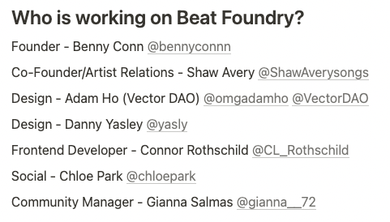
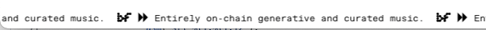
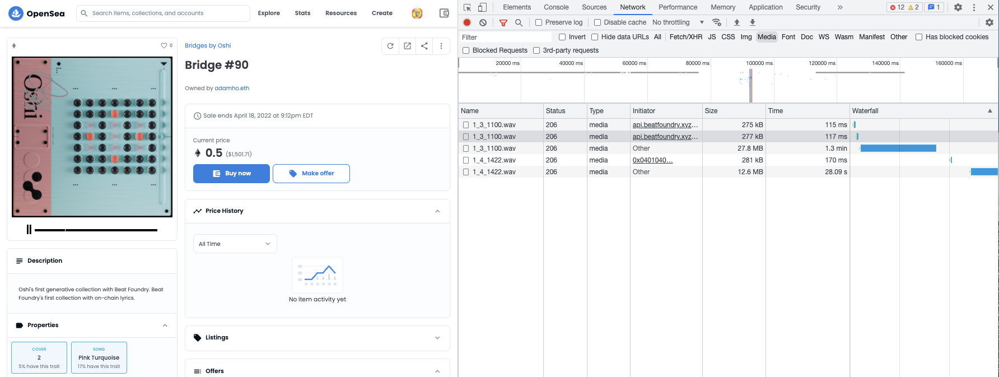
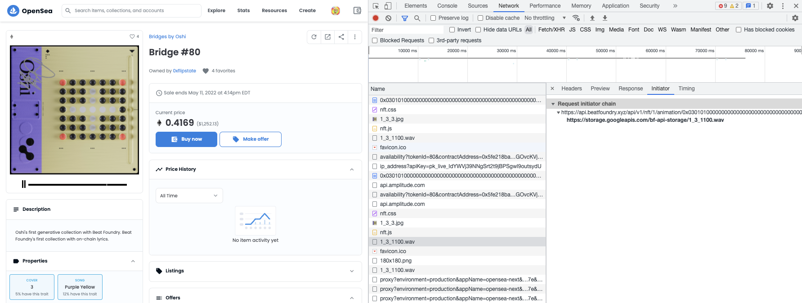
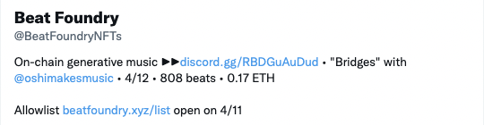
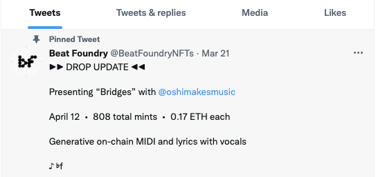
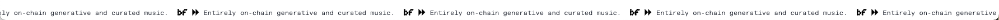

# Ocarinas, Bridges

### [Beats Foundry](https://beatfoundry.xyz/)

<p align="center"></p>

<p align="center"></p>

<p align="center"></p>

<p align="center"></p>

## <p align="center"></p>

<p align="center"></p>

---

<p align="center"></p>

---

<p align="center"></p>

---

<p align="center"></p>

---

---

[google-storage](https://storage.googleapis.com/bf-api-storage/)

# Animation/iFrame

[asset iframe](https://api.beatfoundry.xyz/api/v1/nft/1/animation/0x0101030102000000000000000000000000000000000000000000000000000000)

[bridges oshi transactions json](./chords/ransactions-bridges-oshi.json)
[ocarinas transactions json](./chords/transactions-ocarinas.json)

# Introduction

After cloning the repository, install, build, and compile contract and run test.

```bash
yarn && yarn run build && yarn run compile && yarn run test
npx hardhat run --network rinkeby ./scripts/deploy.ts
```
